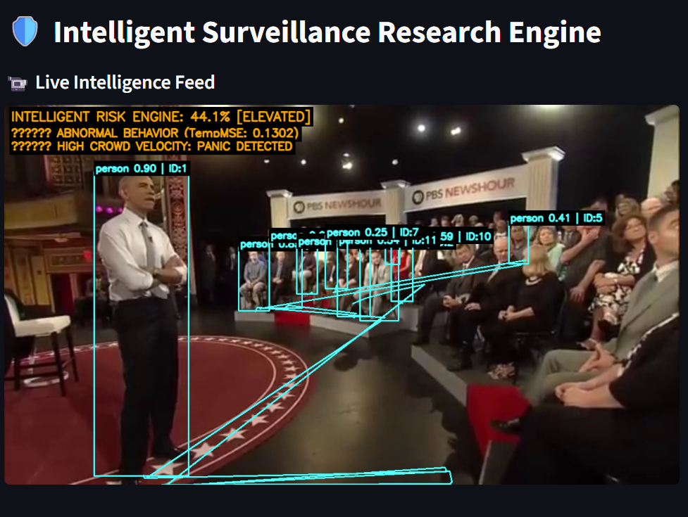
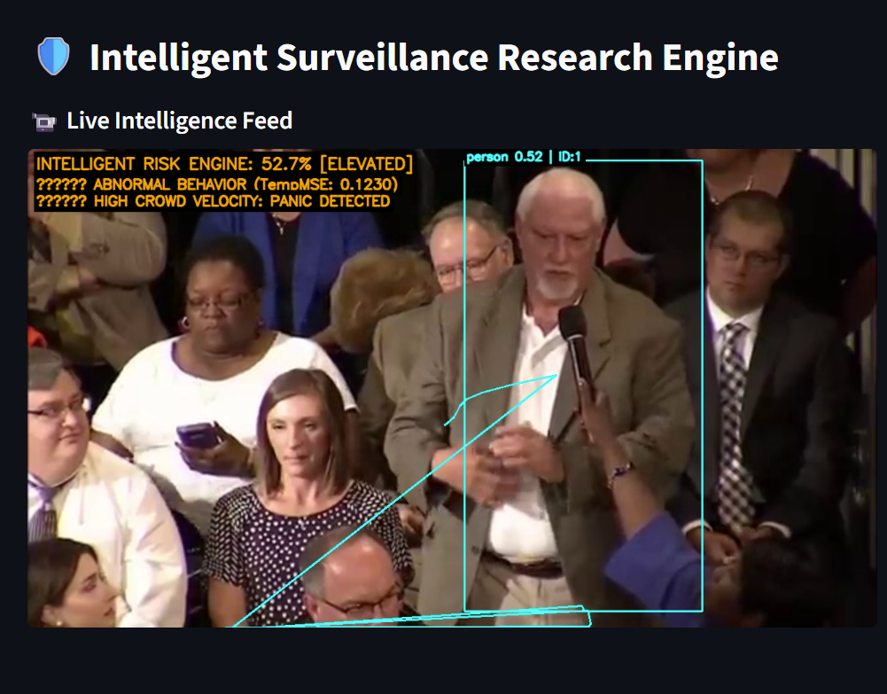
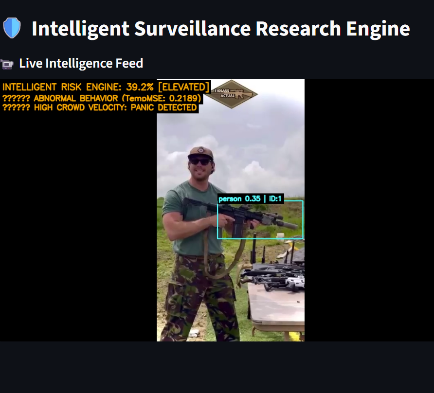
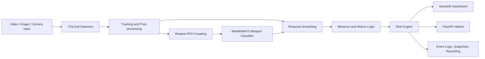

# AI-Based Crowd Monitoring and Weapon Detection System


Production-oriented computer vision system for real-time crowd monitoring, weapon detection, gun-vs-knife classification, alerting, event logging, and dashboard-based surveillance review.

## Why This Repository Matters

- Detects `person` and `weapon` objects from live or uploaded visual streams
- Uses a two-stage pipeline for more reliable weapon reasoning:
  - Stage 1: YOLOv8 localization
  - Stage 2: MobileNetV3 gun-vs-knife classification on weapon ROIs
- Stabilizes predictions with tracking, temporal smoothing, and confidence gating
- Provides an operator-facing Streamlit dashboard and a backend FastAPI endpoint
- Supports alert banners, audio beeps, event logs, snapshots, and annotated recordings

## Dashboard Preview

<table>
  <tr>
    <td></td>
    <td></td>
  </tr>
  <tr>
    <td align="center">Multi-panel command-center style dashboard</td>
    <td align="center">Focused feed with live metrics and alert context</td>
  </tr>
</table>

<p align="center">
  
</p>

## System Architecture



## Core Capabilities

- Real-time annotated video monitoring
- Person detection with track-based crowd counting
- Weapon detection with `gun` vs `knife` classification
- Risk-level generation for operator awareness
- Alert banner and sound trigger when weapons are present
- Event logging to CSV and JSONL
- Snapshot capture on high-risk events
- Annotated output recording to disk
- Multi-feed dashboard support
- Image upload, video upload, and camera / stream input

## Main Production Application

The production-ready application lives in [`project/`](./project).

- [`project/app.py`](./project/app.py): Streamlit surveillance dashboard
- [`project/api_server.py`](./project/api_server.py): FastAPI inference service
- [`project/backend/pipeline.py`](./project/backend/pipeline.py): shared end-to-end runtime
- [`project/detector/yolo_detector.py`](./project/detector/yolo_detector.py): YOLOv8 detection and tracking-aware filtering
- [`project/classifier/weapon_classifier.py`](./project/classifier/weapon_classifier.py): MobileNetV3 weapon classifier
- [`project/utils/smoothing.py`](./project/utils/smoothing.py): temporal stabilization
- [`project/utils/behavior.py`](./project/utils/behavior.py): motion and suspicious behavior heuristics
- [`project/utils/risk_engine.py`](./project/utils/risk_engine.py): interpretable risk scoring
- [`project/config.yaml`](./project/config.yaml): runtime thresholds and system behavior

## Repository Structure

```text
Crowd and Anomaly Detection/
├── project/                     # Main production app and backend
│   ├── app.py                   # Streamlit dashboard
│   ├── api_server.py            # FastAPI API
│   ├── backend/                 # Shared runtime, logging, recording, alerts
│   ├── detector/                # YOLOv8 detector + tracker config
│   ├── classifier/              # MobileNetV3 classifier + training utilities
│   ├── utils/                   # Smoothing, behavior, risk engine
│   ├── config.yaml              # Runtime settings
│   └── requirements.txt         # App dependencies
├── pipelines/                   # Training and preparation scripts
├── data_preparation/            # Dataset conversion and cleanup
├── anomaly/                     # Anomaly and motion-analysis experiments
├── detection/                   # Legacy detector utilities
├── utils/                       # Shared support utilities
├── merge_dataset.py             # Dataset class-merging utility
└── merge_yolo_datasets_strict.py
```

## Quick Start

### 1. Install dependencies

```bash
cd project
pip install -r requirements.txt
```

### 2. Place model files

Add the model checkpoints here:

- `project/models/best.pt`
- `project/models/classifier.pth`

These artifacts are intentionally excluded from Git because of size and experiment management.

### 3. Run the Streamlit dashboard

```bash
cd project
streamlit run app.py
```

### 4. Run the FastAPI server

```bash
cd project
uvicorn api_server:app --host 0.0.0.0 --port 8000
```

## API Endpoints

### `GET /health`

- returns server health
- returns detector path
- reports classifier availability

### `POST /detect`

Form fields:

- `file`: uploaded image
- `source_id`: optional source identifier

Response includes:

- detections
- crowd count
- risk summary
- alert state
- active tracks
- dominant weapon
- snapshot path when available

## Configurable Runtime

Runtime behavior is controlled through [`project/config.yaml`](./project/config.yaml).

Configurable areas include:

- detection thresholds
- classifier confidence floors
- temporal smoothing settings
- motion behavior thresholds
- alert toggles
- logging output paths
- recording output paths
- UI defaults
- API host and port

## Training and Dataset Tooling

This repository also contains the broader engineering workflow used to build and iterate on the system.

- detector training utilities in [`pipelines/`](./pipelines)
- dataset merge and cleanup utilities in the repo root
- classifier crop generation and training in [`project/classifier/`](./project/classifier)
- anomaly and motion-analysis experimentation in [`anomaly/`](./anomaly)

Key utilities:

- [`merge_dataset.py`](./merge_dataset.py)
- [`merge_yolo_datasets_strict.py`](./merge_yolo_datasets_strict.py)
- [`coco_to_yolo_person.py`](./coco_to_yolo_person.py)
- [`split_coco_person.py`](./split_coco_person.py)
- [`pipelines/train_yolo_detector.py`](./pipelines/train_yolo_detector.py)
- [`project/classifier/build_weapon_dataset.py`](./project/classifier/build_weapon_dataset.py)
- [`project/classifier/train_weapon_classifier.py`](./project/classifier/train_weapon_classifier.py)

## Engineering Notes

- The main deployable application is the `project/` directory
- Root-level scripts are preserved because they reflect the real project workflow:
  - preprocessing
  - dataset merging
  - detector training
  - classifier training
  - evaluation and experimentation
- Large datasets, videos, model weights, and generated outputs are excluded through [`.gitignore`](./.gitignore)

## Roadmap

- stronger dense crowd handling with expanded person datasets
- more robust small-weapon detection
- richer behavior analysis beyond speed-based heuristics
- edge-device deployment optimization
- multi-camera orchestration and centralized monitoring

## GitHub Metadata

Suggested GitHub repository description and topics are documented in [`docs/GITHUB_REPO_SETTINGS.md`](./docs/GITHUB_REPO_SETTINGS.md).

## Practical Use Cases

- smart city surveillance
- campus security monitoring
- mall and station monitoring
- restricted-zone weapon alerting
- incident review and post-event analysis

